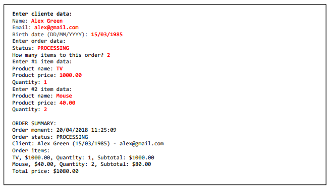
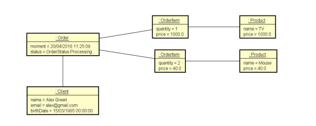
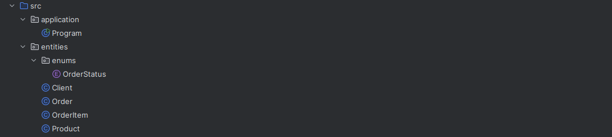

# Exercício para treinar conceitos de Composição e Enumeração em Java

## Enumerações:
É um tipo especial que serve para especificar de forma literal um conjunto de constantes relacionadas.
* Uma **enum** é um tipo especial de classe em Java que representa um conjunto fixo de constantes.

Exemplo:
``` Java
public enum DiaDaSemana {
    SEGUNDA, 
    TERCA, 
    QUARTA, 
    QUINTA, 
    SEXTA, 
    SABADO, 
    DOMINGO;
}
```
## Composição:
É um tipo de associação que permite que um objeto contenha outro, essa associação entre objetos tem
relação "tem-um" ou "tem-vários".
* Uma classe usa composição quando contém outra classe como atributo.

## Objetivo do exercício:


Nosso objetivo é criar uma pequena aplicação que no final deve mostrar o sumário do pedido
* Esse pedido tem que ser composto por algumas classes, entre elas, os itens, os produtos, os clientes e,
é claro um tipo enumerado contendo o status de cada pedido.



Utilizando da classe Order com conceitos de **Composição** e **Enumeração** criamos uma pequena lógica
utilizando entrada de dados para preencher os dados do cliente e do pedido para logo em seguida exibir
os dados através da saíde de dados.

### Comportamento em memória:


Veja que quando instânciarmos nosso objeto Order, ele será composto por outros objetos intânciados
* Temos o objeto **Product** que compõe o objeto **OrderItem**
* O objeto **OrderItem** compõe o objeto **Order**
* por fim temos o objeto **Client** compondo o objeto **Order** juntamente com nosso tipo Enumerado
  **OrderStatus**

### Estrutura do programa:


Aqui temos a estrutura do nosso programinha com uma package armazenando a classe Program que tem o entrypoint
da nossa aplicação

Temos também o package entities que contém a classe Order e as classes que compõem a nossa classe Order.